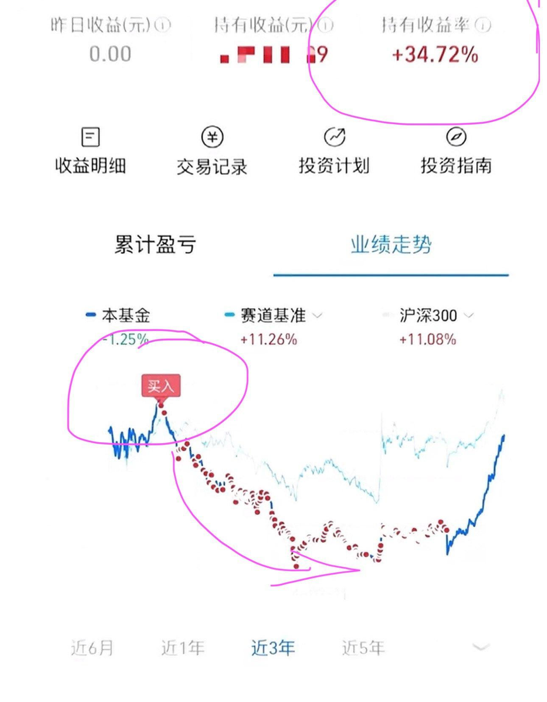

下面是一张网图，看到后刚好截图给小白科普一下定投的好处。

适合上班族（当一个定期存款）

如果你直接买在了最低点（比如咱之前的科创 50 的 950）那是可以直接满仓进的，可是如果你抓不到最低点，那就只能在相对底部开始逢低建仓，定期加仓，逐渐把仓位在低位加满。一直拿到趋势反转获利后出局。

基金也忌讳满仓高位追涨！因为一旦追在历史高点，几年也无法解套！

一、基金定投是什么？

基金定投（基金定期定额投资）就是：

  - 在固定的时间（比如每月 1 号），
  - 以固定的金额（比如 1000 元），
  - 自动购买某一只基金（通常是指数基金）。

它的本质是 “分批买入，分散风险”。这样做的目的：

  - 不用盯盘择时，省心。
  - 避免一次性买在高点的风险。
  - 长期拉平成本，享受市场平均收益。

二、微笑曲线是什么？

在基金定投中，有一个形象的比喻：收益曲线像一个“微笑”。

意思是：

1. 市场下跌 → 你在低点不断买入 → 成本摊低。
2. 市场回升 → 之前低价买的份额增值 → 收益迅速增长。也就是我们最近一直说的“收集筹码”

最终的收益曲线呈现 “先低后高，中间下沉，两边上扬”，像一个微笑。

三、关键要点

1. 前提：市场长期向上（比如宽基指数基金：沪深 300、中证 500、标普 500）。

2. 持有周期：时间要足够长，最好 3-5 年以上。

3. 心态：下跌时别害怕，反而要高兴，因为便宜份额更多。

4. 退出策略：设定目标收益率（如 30%），分批止盈，避免贪心。

微笑曲线的核心：跌的时候积累便宜筹码，涨的时候享受丰厚收益。

在这个图上，如果是高位一笔买入，不做定投，那到最后可能还没回本呢。对于一些大市值的趋势股或者周期股也可以在底部分批建仓，少量多次买入收集筹码！

底部赚筹码，不要在意涨跌价格波动，高位才会有超级多的利润！

最近（2025 年 9 月）科技方向的基金是不是热卖？这就是风险之一！

所以必定会调整的！ 还有不要买首发基金，都是要先套一段时间的。机构会先去做空套利。 基金一定要在大跌大跌大跌之后一点点地买到拐点，趋势反转！

指数定投适合熊末牛初的结合处，牛市高潮见顶，基金热卖的时候绝对不要进！

基金指数要买在人人骂他，狗都不买它的时候哦！
